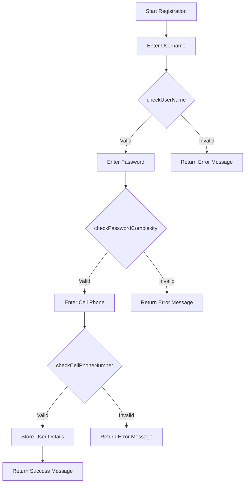
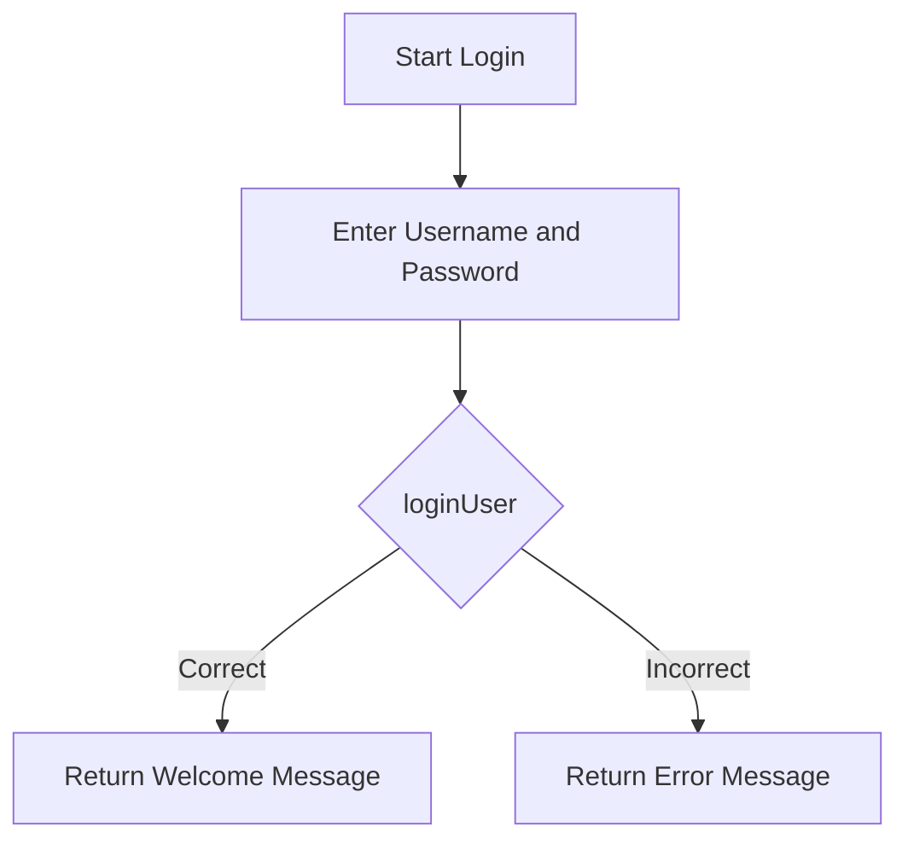

# PROG5121 Part 1 – Chat App 

- **Student Name:** Khanyisa Ntsko Shikwambana 
- **Student Number:** ST10476385  
- **Module:** PROG5121  
- **Submission Date:** 18 September 2026  
- **YouTube Link:**
---

##  Table of Contents

- [Project Overview](#project-overview)
- [Features](#features)
- [Technologies Used](#technologies-used)
- [Setup Instructions](#setup-instructions)
- [How to Run the Application](#how-to-run-the-application)
- [How to Run Unit Tests](#how-to-run-unit-tests)
- [Application Flow](#application-flow)
- [Code Structure](#code-structure)
- [Validation Rules](#validation-rules)
- [Citations and References](#citations-and-references)
- [YouTube Presentation](#youtube-presentation)
- [Acknowledgements](#acknowledgements)

---

##  Project Overview

This is **Part 1** of the Chat App Proof of Engagement (PoE) for the module PROG5121. The project implements a **console-based registration and login system** that allows users to:

1. **Create an account** by providing a username, password, and South African cell phone number.
2. **Log in** using the same credentials.

The application validates all inputs using the rules specified in the assignment brief and provides clear feedback to the user.

---

##  Features

| Feature | Description |
|---------|-------------|
| **Username Validation** | Must contain an underscore (`_`) and be no more than 5 characters long. |
| **Password Complexity** | Must be at least 8 characters, contain a capital letter, a number, and a special character. |
| **Cell Phone Validation** | Must start with the South African country code (`+27`) and be followed by 1–10 digits. |
| **Registration** | Stores user details (first name, last name, username, password, cell number). |
| **Login** | Verifies credentials and returns a welcome message or error message. |
| **Unit Testing** | Comprehensive JUnit 5 tests covering all validation rules and login flows. |

---

##  Technologies Used

| Technology | Purpose |
|------------|---------|
| **Java** (JDK 25) | Core programming language |
| **Maven** | Build automation and dependency management |
| **JUnit 5** | Unit testing framework |
| **Git** | Version control |
| **GitHub** | Remote repository hosting |
| **NetBeans IDE** | Development environment |

---

##  Project Structure

```
ChatApp-Part1/
│
├── src/
│   ├── main/
│   │   └── java/
│   │       └── com/
│   │           └── mycompany/
│   │               └── chatapp/
│   │                   └── part1/
│   │                       ├── ChatAppPart1.java   (Main console interface)
│   │                       └── Login.java           (Registration & login logic)
│   │
│   └── test/
│       └── java/
│           └── com/
│               └── mycompany/
│                   └── chatapp/
│                       └── part1/
│                           └── LoginTest.java      (JUnit 5 unit tests)
│
├── pom.xml                                         (Maven configuration)
└── README.md                                       (This file)
```

---

##  Setup Instructions

### Prerequisites
- **Java JDK 25** or later
- **Maven** (optional – if using the command line)
- **NetBeans IDE** (recommended)
- **Git** (for version control)
- **GitHub account** (for submission)

### Clone the Repository

```bash
git clone https://github.com/yourusername/[PROG5121-Part1-ChatApp-st10476385.git](https://github.com/ST10476385/PROG5121-POE-ChatApp.git)
cd PROG5121-Part1-ChatApp-st10476385
```

### Open in NetBeans

1. Open NetBeans IDE.
2. Go to **File → Open Project**.
3. Navigate to the project folder and select it.
4. Click **Open Project**.

---

##  How to Run the Application

### Option 1: Run from NetBeans

1. In the **Projects** tab, expand `ChatApp-Part1`.
2. Expand **Source Packages** → `com.mycompany.chatapp.part1`.
3. Right-click `ChatAppPart1.java` → **Run File** (or press `Shift + F6`).

### Option 2: Run from Command Line (with Maven)

```bash
mvn compile
mvn exec:java -Dexec.mainClass="com.mycompany.chatapp.part1.ChatAppPart1"
```

### Expected Output

The application will guide you through registration and login:

```
=== Registration ===
Enter a username (must contain _ and be 5 characters or less): kyl_1
Enter a password (8+ characters, a capital letter, a number and a special character): Ch&&sec@ke99!
Enter your cell number (with country code, example +27614880723): +27838968976
Enter your first name: John
Enter your last name: Doe
Username successfully captured. Password successfully captured. Cell phone number successfully added.

=== Login ===
Enter your username: kyl_1
Enter your password: Ch&&sec@ke99!
Welcome John, Doe it is great to see you again.
```


---

##  How to Run Unit Tests

### Option 1: Run from NetBeans

1. In the **Projects** tab, expand **Test Packages** → `com.mycompany.chatapp.part1`.
2. Right-click `LoginTest.java` → **Test File** (or press `Ctrl + F6`).

### Option 2: Run from Command Line (with Maven)

```bash
mvn test
```


### Expected Test Output

All tests should pass with a **green bar**:

```
Tests run: 14, Failures: 0, Errors: 0, Skipped: 0
BUILD SUCCESS
```


---

##  Application Flow

### Registration Flow



### Login Flow



---

##  Validation Rules

### Username Rules
| Condition | Valid Example | Invalid Example |
|-----------|---------------|-----------------|
| Contains underscore (`_`) | `kyl_1` | `kyle` |
| Maximum 5 characters | `kyl_1` | `kyle!!!!!!!` |

### Password Rules
| Condition | Valid Example | Invalid Example |
|-----------|---------------|-----------------|
| At least 8 characters | `Ch&&sec@ke99!` | `pass` |
| Contains a capital letter | `Ch&&sec@ke99!` | `password` |
| Contains a number | `Ch&&sec@ke99!` | `Password!` |
| Contains a special character | `Ch&&sec@ke99!` | `Password123` |

### Cell Phone Rules
| Condition | Valid Example | Invalid Example |
|-----------|---------------|-----------------|
| Starts with `+27` | `+27838968976` | `08966553` |
| Followed by 1–10 digits | `+27838968976` | `+271234567890123` |

---


##  References


GeeksforGeeks. (2026) *Regular Expressions in Java*. Available at: https://www.geeksforgeeks.org/regular-expressions-in-java/ (Accessed: 20 August 2026).

GitHub. (2026) *GitHub Documentation*. Available at: https://docs.github.com/ (Accessed: 20 August 2026).

GitHub Desktop. (2026) *GitHub Desktop Tutorial*. Available at: https://www.youtube.com/watch?v=bUgFv1Y5LJw (Accessed: 20 August 2026).

GitHub Actions Tutorial. (2026) *CI/CD with GitHub Actions*. Available at: https://www.youtube.com/watch?v=oz0Qd5H4Onk (Accessed: 20 August 2026).

JUnit 5. (2026) *JUnit 5 User Guide*. Available at: https://junit.org/junit5/docs/current/user-guide/ (Accessed: 20 August 2026).

JUnit Tutorial. (2026) *JUnit in NetBeans*. Available at: https://www.youtube.com/watch?v=MOhiM2SXZI0 (Accessed: 20 August 2026).

NetBeans IDE. (2026) *NetBeans Downloads*. Available at: https://netbeans.org/downloads/ (Accessed: 20 August 2026).

PROG5121 Module Outline. (2026) Available at: https://advtechonline.sharepoint.com/:w:/r/sites/TertiaryStudents/_layouts/15/Doc.aspx?sourcedoc=%7B5B770B77-2908-402A-A5DD-30ED47D82E66%7D&file=PROG5121_MO.docx&action=default&mobileredirect=true (Accessed: 20 August 2026).

QuickBlox. (2026) *Beginner's Guide to Chat App Architecture*. Available at: https://quickblox.com/blog/beginners-guide-to-chat-app-architecture/ (Accessed: 20 August 2026).

Smith, J. (2023) *Java Regex Tutorial*. Available at: https://example.com/java-regex (Accessed: 20 August 2026).

Stack Overflow. (2026) *Regular expression to match South African cell phone numbers*. Available at: https://stackoverflow.com/questions/16699007/ (Accessed: 20 August 2026).

### Prescribed Textbooks

Farrell, J. (2019) *Java Programming*. 9th edn. Course Technology, Cengage Learning.

Farrell, J. (2024) *Java Programming*. 10th edn. Course Technology, Cengage Learning.

### Recommended Readings

Burd, B. (2022) *Java for Dummies*. 8th edn. John Wiley and Sons. ISBN: 978-1119861645.

Cadenehead, R. (2020) *Sams Teach Yourself Java in 21 Days*. 8th edn. Sams Publishing. ISBN: 978-0672337956.

##  YouTube Presentation

As required by the assignment, a video presentation explaining the code, logic, and flow has been created and uploaded to YouTube.

**Presentation Link:** 


### What the Presentation Covers

-  Overview of the project and its purpose
-  Explanation of the `Login` class and all methods
-  Demonstration of the registration and login process
-  Explanation of validation logic (username, password, cell phone)
-  Running and explaining the unit tests
-  Code walkthrough and flow explanation

---

##  Acknowledgements

I would like to thank:

- My lecturer for providing clear instructions and guidance.
- My fellow students for their support and collaboration.
- The open-source community for providing valuable resources and tutorials.

---

##  Disclaimer

This project was developed as part of an academic assessment for PROG5121. All code is original work except where explicitly credited. External resources are cited appropriately in the code and in this README file.

---

##  Contact

If you have any questions about this project, please contact:

**Student Name:** Khanyisa Ntsako Shikwambana 
**Student Number:** st10476385  
**Email:** st10476385@rcconnect.edu.za 

---

**© 2026 – PROG5121 Chat App Part 1**  
*All rights reserved.*
```
